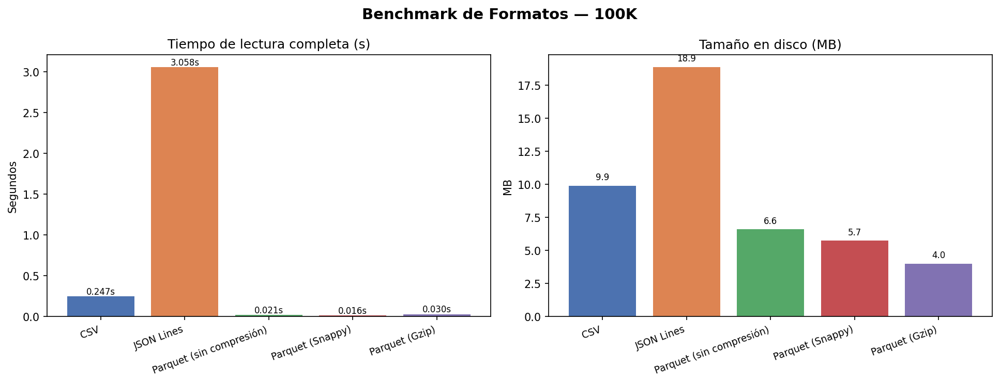
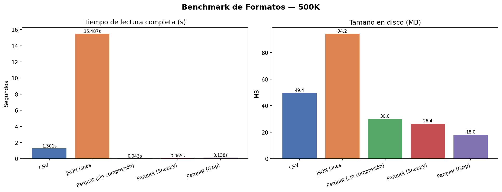
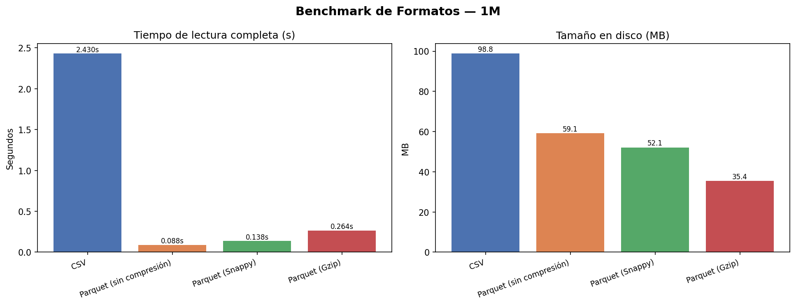

# Reporte — Formatos Bajo la Lupa

**Módulo:** Python para Sistemas de Datos Modernos  
**Ejercicio:** 1 — Benchmark de Formatos de Almacenamiento  
**Dataset:** Transacciones financieras (100k / 500k / 1M registros, 8 columnas)  
**Formatos evaluados:** CSV, JSON Lines, Parquet (sin compresión), Parquet (Snappy), Parquet (Gzip)

---

## 1. Tablas comparativas por escala

### 100,000 registros

| Formato               | Escritura (s) | Lectura completa (s) | Lectura selectiva (s) | Tamaño (MB) | Pico RAM (MB) |
|-----------------------|:-------------:|:--------------------:|:---------------------:|:-----------:|:-------------:|
| CSV                   | 0.3270        | 0.2472               | 0.0581                | 9.88        | 23.99         |
| JSON Lines            | 0.2438        | 3.0584               | 0.3858                | 18.85       | 233.63        |
| Parquet sin comp.     | 0.0500        | 0.0205               | 0.0054                | 6.59        | 7.25          |
| Parquet Snappy        | 0.0588        | 0.0157               | 0.0055                | 5.73        | 5.86          |
| Parquet Gzip          | 1.2642        | 0.0302               | 0.0064                | 3.99        | 4.11          |

### 500,000 registros

| Formato               | Escritura (s) | Lectura completa (s) | Lectura selectiva (s) | Tamaño (MB) | Pico RAM (MB) |
|-----------------------|:-------------:|:--------------------:|:---------------------:|:-----------:|:-------------:|
| CSV                   | 1.6501        | 1.3010               | 0.2442                | 49.42       | 119.34        |
| JSON Lines            | 1.2257        | 15.4872              | 1.8567                | 94.24       | 1168.50       |
| Parquet sin comp.     | 0.1513        | 0.0429               | 0.0163                | 30.01       | 30.66         |
| Parquet Snappy        | 0.2180        | 0.0648               | 0.0158                | 26.40       | 26.54         |
| Parquet Gzip          | 4.1525        | 0.1376               | 0.0199                | 18.04       | 18.16         |

### 1,000,000 registros

| Formato               | Escritura (s) | Lectura completa (s) | Lectura selectiva (s) | Tamaño (MB) | Pico RAM (MB) |
|-----------------------|:-------------:|:--------------------:|:---------------------:|:-----------:|:-------------:|
| CSV                   | 3.2003        | 2.4304               | 0.4571                | 98.84       | 238.53        |
| JSON Lines            | —             | —                    | —                     | —           | —             |
| Parquet sin comp.     | 0.2481        | 0.0885               | 0.0262                | 59.11       | 59.78         |
| Parquet Snappy        | 0.4113        | 0.1375               | 0.0270                | 52.06       | 52.19         |
| Parquet Gzip          | 7.6783        | 0.2640               | 0.0342                | 35.41       | 35.54         |

> **Nota:** JSON Lines no pudo completarse con 1M de registros. La lectura superó los 2 GB de RAM disponible y el proceso fue terminado por el sistema operativo (OOM Killer). Con 500k ya consumía 1168 MB — proyectando linealmente, 1M requeriría ~2.3 GB. Este comportamiento se documenta como hallazgo en las conclusiones.

---

## 2. Gráficas

### 100,000 registros

### 500,000 registros

### 1,000,000 registros

---

## 3. Conclusiones

### 3.1 Por qué Parquet es tan rápido en lectura

La diferencia más llamativa del benchmark es la velocidad de lectura de Parquet frente a CSV y JSON Lines. Con 1M de registros, CSV tarda 2.43 segundos en leer el archivo completo; Parquet Snappy lo hace en 0.14 segundos —**17 veces más rápido**. Esta diferencia no se explica por el tamaño del archivo sino por la arquitectura interna del formato.

Parquet es un formato **columnar**: en lugar de guardar fila a fila (como CSV o JSON), agrupa los valores de cada columna juntos en el disco. Cuando una consulta necesita solo dos columnas —como en la lectura selectiva de `amount` y `category`— Parquet puede **saltar físicamente** las demás sin leerlas. El resultado se ve en los números: con 1M de filas, la lectura selectiva de Parquet Snappy tarda 0.027s; la de CSV tarda 0.457s, es decir, **17 veces más lenta**, a pesar de que `pd.read_csv(usecols=...)` ya optimiza el parseo de columnas. La razón es que CSV, al ser un formato orientado a filas, obliga al parser a recorrer cada línea completa para identificar qué campos corresponden a qué columna antes de descartar las que no se necesitan.

Adicionalmente, Parquet almacena metadatos de estadísticas por columna (mínimo, máximo, cardinalidad estimada) en el footer del archivo. Esto permite a los motores de consulta saltarse grupos de filas completos antes de leer datos —técnica conocida como *predicate pushdown*— lo que en pipelines de analytics representa una ventaja estructural que CSV no puede replicar.

### 3.2 Por qué JSON Lines es inviable a escala

JSON Lines es el formato con peor desempeño en casi todas las métricas. Con 500k registros, la lectura tarda **15.49 segundos** y consume **1168 MB de RAM**. Con 1M, el proceso es terminado directamente por el sistema operativo por falta de memoria. Para contexto: el archivo CSV de 500k pesa 49 MB y se lee en 1.30 segundos usando 119 MB de RAM. El archivo JSON equivalente pesa 94 MB y tarda 15.49 segundos usando casi 1.2 GB —**10 veces más memoria** para el mismo dato.

Hay dos causas estructurales. La primera es el **parseo carácter a carácter**: JSON debe identificar delimitadores (`{`, `"`, `:`, `,`, `}`), validar la sintaxis y construir un árbol de objetos Python en memoria antes de convertirlos a DataFrame. CSV solo busca comas y saltos de línea, que es una operación mucho más barata. La segunda es la **representación intermedia**: `pd.read_json(lines=True)` crea objetos Python para cada valor antes de construir los arrays de numpy. Un float como `1234.56` vive primero como string, luego como objeto Python float, y finalmente como numpy float64. En Parquet ese mismo valor se lee directamente en su representación binaria final sin pasos intermedios.

El dato más revelador es que JSON Lines fue el formato **más rápido en escritura** con 100k filas (0.24s vs 0.33s de CSV), pero el más lento en lectura por un factor de 12x. Esto refleja que el costo de serializar a JSON es bajo, pero el de deserializar es prohibitivo a escala. Repetir la lectura 3 veces para JSONL en escalas mayores habría sido imposible: con 500k el proceso ya consumía 1168 MB en la primera lectura, sin margen para repeticiones adicionales.

### 3.3 La asimetría de Gzip: escribir caro, leer barato

Parquet Gzip presenta el comportamiento más contraintuitivo del benchmark: es el formato **más lento para escribir** con diferencia (7.68s con 1M filas, frente a 0.41s de Snappy —19x más lento) pero tiene tiempos de lectura razonables (0.26s con 1M). La pregunta natural es: ¿por qué escribir es tan caro si leer no lo es?

Gzip usa el algoritmo LZ77, que construye un árbol de frecuencias de patrones recurrentes en los datos para generar un diccionario de sustituciones. Este proceso requiere múltiples pasadas sobre los datos y es computacionalmente intenso. Para descomprimir, solo se consulta ese diccionario en una pasada lineal —operación rápida y barata. Snappy, por contraste, fue diseñado explícitamente para ser veloz en ambas direcciones a cambio de menor tasa de compresión.

Los números lo confirman: Gzip lleva el archivo de 1M registros a **35.41 MB** (64% de reducción respecto al CSV de 98.84 MB); Snappy llega a **52.06 MB** (47% de reducción). La diferencia de 16.6 MB puede parecer menor en un solo archivo, pero en un sistema que almacena miles de particiones en S3 o GCS esa diferencia se traduce directamente en costo de almacenamiento y en tiempo de transferencia de red.

La consecuencia práctica es clara: Gzip conviene cuando los datos se escriben una vez y se leen muchas (datos históricos, cold storage), o cuando el almacenamiento es el factor dominante. Snappy conviene cuando hay escrituras frecuentes o cuando los pipelines regeneran archivos constantemente.

### 3.4 Cómo cambia el comportamiento al escalar de 100k a 1M

Una observación relevante del benchmark es que el comportamiento **no escala igual** en todos los formatos al pasar de 100k a 1M de registros (10x más datos).

CSV escala de forma casi perfectamente lineal: 10x más datos produce 9.8x más tiempo de escritura (0.33s → 3.20s) y 9.8x más tiempo de lectura (0.25s → 2.43s). Esto es esperable porque CSV no tiene estructura interna que se aproveche del volumen: cada byte requiere el mismo procesamiento independientemente del tamaño total.

Parquet escala con ventaja al crecer. La escritura de Parquet Snappy va de 0.059s (100k) a 0.411s (1M), un factor de 7x para 10x más datos. Esto se debe a que la codificación por diccionario que usa Parquet internamente es **más eficiente con más repeticiones**: las columnas `category` (10 valores únicos) y `country_code` (15 valores únicos) se compactan mejor cuando hay 100k apariciones de cada valor que cuando hay solo 10k. La relación señal/ruido del compresor mejora con el volumen, y este efecto se amplifica con Gzip que pasa de 1.26s (100k) a 7.68s (1M) —solo 6x de penalización de escritura para 10x más datos, porque LZ77 encuentra más patrones repetibles.

El caso más revelador es el de la memoria en JSON Lines: de 100k a 500k (5x más datos), el pico de RAM pasa de 233 MB a 1168 MB —exactamente 5x. La escala es perfectamente lineal, lo que confirma que no existe ninguna optimización interna: JSON Lines construye una representación Python de cada registro sin importar cuántos haya. Proyectando ese factor a 1M de registros, el requerimiento de ~2.3 GB de RAM explica directamente por qué el proceso es terminado por el sistema operativo.

### 3.5 La lectura selectiva como diferenciador real

Con 1M de filas, leer solo `amount` y `category` en Parquet Snappy tarda **0.027 segundos**. Hacer lo mismo leyendo el CSV completo con `usecols` tarda **0.457 segundos**: 17 veces más lento, y encima carga en memoria las otras 6 columnas durante el parseo antes de descartarlas.

Esta diferencia se amplifica en entornos de producción donde múltiples procesos acceden al mismo archivo, o donde los archivos son particiones de datasets mucho más grandes. Una consulta analítica típica —calcular el monto promedio por categoría, por ejemplo— solo necesita 2 de las 8 columnas. Con CSV, el sistema paga el costo completo de I/O y memoria por las 8 columnas aunque deseche 6 inmediatamente. Con Parquet, el costo es proporcional a las columnas que realmente se leen porque la proyección ocurre a nivel de bloques físicos del archivo, antes de que los datos lleguen a memoria.

---

## 4. Recomendación final

**Para este caso de uso en producción: Parquet con compresión Snappy.**

**Rendimiento de lectura.** Las cargas analíticas (agregaciones, filtros, joins) se benefician directamente del formato columnar. Parquet Snappy lee 1M de registros en 0.14s frente a los 2.43s de CSV. En un pipeline que ejecuta decenas de consultas por minuto, esta diferencia acumula minutos de cómputo ahorrado por hora de operación.

**Eficiencia de memoria.** Parquet Snappy con 1M filas usa 52 MB de RAM en el pico de lectura. CSV usa 238 MB —4.6 veces más— porque debe mantener strings crudos en memoria durante el parseo antes de convertirlos a tipos nativos. En contenedores con límites de memoria esta diferencia puede ser la frontera entre un proceso estable y un OOM.

**Balance escritura/lectura.** Snappy escribe 1M filas en 0.41s, perfectamente viable para cualquier pipeline de ingesta. Gzip tarda 7.68s en escritura —19x más lento que Snappy— lo que lo hace impráctico para datos que se reescriben con frecuencia.

**Compatibilidad con el ecosistema.** Parquet es el formato nativo de DuckDB, Spark, BigQuery, Athena y prácticamente todo motor analítico moderno. Un archivo Parquet Snappy generado con pandas puede ser leído directamente por DuckDB sin conversión, lo que simplifica arquitecturas multi-herramienta.

**Cuándo CSV sigue siendo válido:** para archivos pequeños (menos de 10k filas), para intercambio con sistemas externos que no soporten Parquet, o cuando el archivo necesita ser inspeccionado manualmente. Para flujos internos de datos a escala, CSV es una deuda técnica silenciosa que crece con el volumen.

**Cuándo elegir Gzip sobre Snappy:** cuando los datos se escriben una sola vez y se consultan muchas (cold storage, datos históricos), cuando el almacenamiento es el costo dominante, o cuando la red es el cuello de botella ya que archivos más pequeños reducen el tiempo de transferencia.

**JSON Lines no debería usarse** como formato de almacenamiento analítico para este tipo de datos. Su único caso de uso justificado es como formato de ingesta desde APIs o sistemas externos donde el productor no controla el formato de salida. En cuanto los datos entran al sistema, la conversión a Parquet es obligatoria.

---

*Mediciones realizadas en Python 3.14 con `time.perf_counter()`. Escrituras: promedio de 3 repeticiones. Lecturas: promedio de 3 repeticiones (pico de memoria registrado en la primera ejecución, sin page cache caliente). Dataset generado con semilla fija (`seed=42`) para reproducibilidad entre escalas.*
